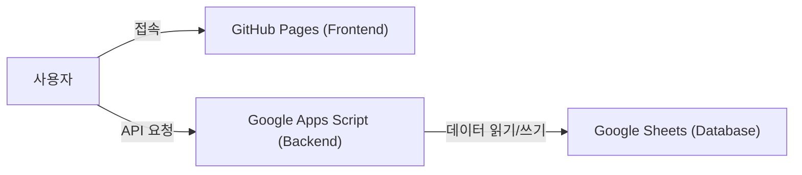

# Moni - 나만의 간단한 가계부

Moni는 나만 사용하는 가장 간단한 가계부입니다.

Google Sheets를 데이터베이스로 활용하여 별도의 서버 없이 지출과 수입을 기록하고 통계를 확인할 수 있습니다.

## 시스템 아키텍처

* **Frontend**: GitHub Pages를 통해 배포된 React PWA 애플리케이션
* **Backend**: Google Apps Script (GAS)를 통해 RESTful API 엔드포인트 구현
* **Database**: Google Sheets를 실제 데이터 저장소로 활용하여 비용 효율적이고 접근성 높은 데이터 관리

## 기술 스택

### Frontend
* **Core**: React 19, TypeScript, Vite
* **Hosting**: GitHub Pages
* **Styling**: Tailwind CSS 4
* **State/Data**: React Query, Context API
* **Charts**: Recharts
* **PWA**: vite-plugin-pwa

### Backend
* **Runtime**: Google Apps Script
* **Deployment**: Clasp
* **Data**: Google Spreadsheets

## 주요 기능
* **지출/수입 기록**: 간편하게 내역을 기록합니다
* **통계 확인**: 카테고리별, 기간별 지출을 한눈에 확인합니다

## 시작하기
배포 및 개발 가이드는 `CLAUDE.md`를 참고하세요.